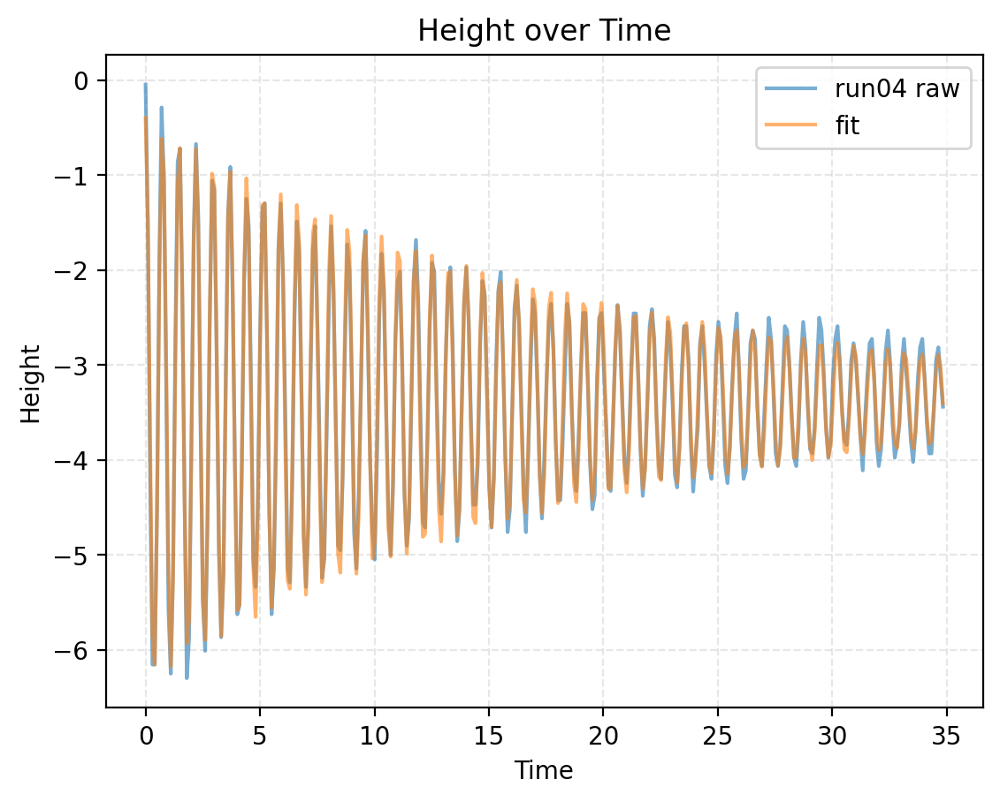
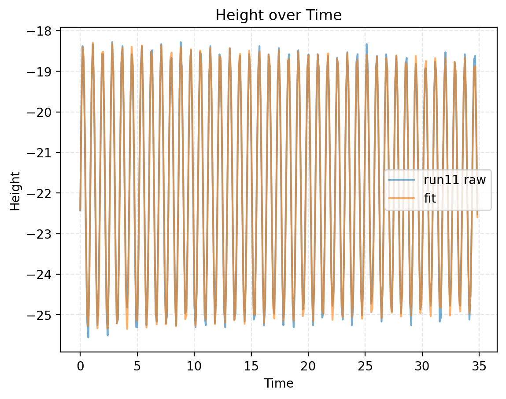
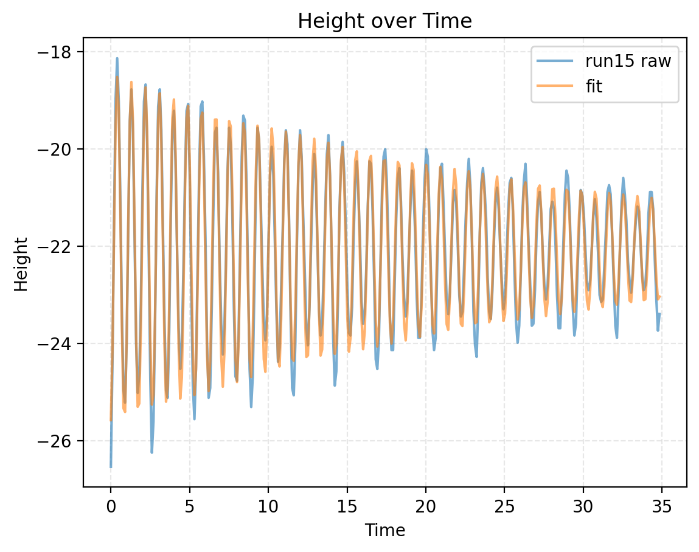
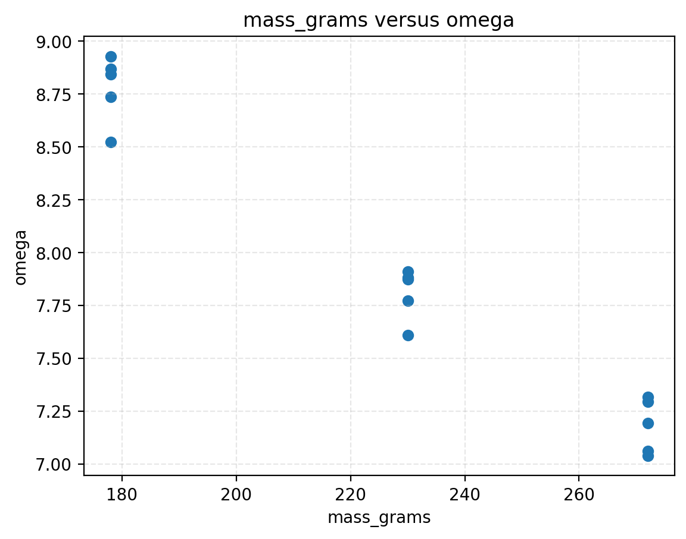
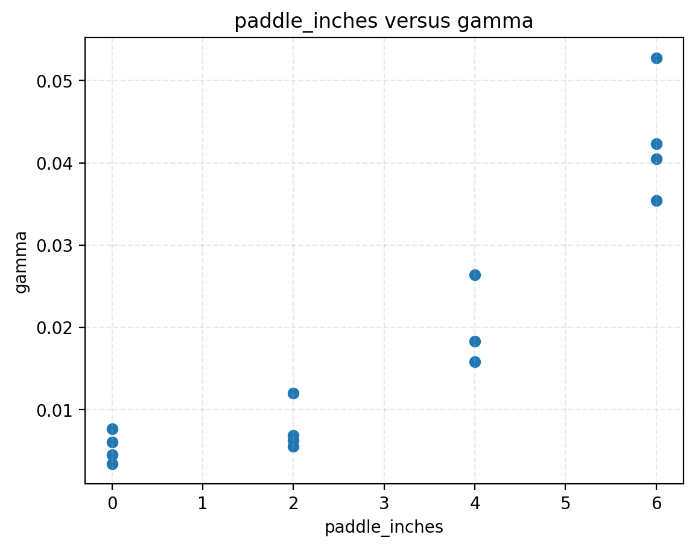
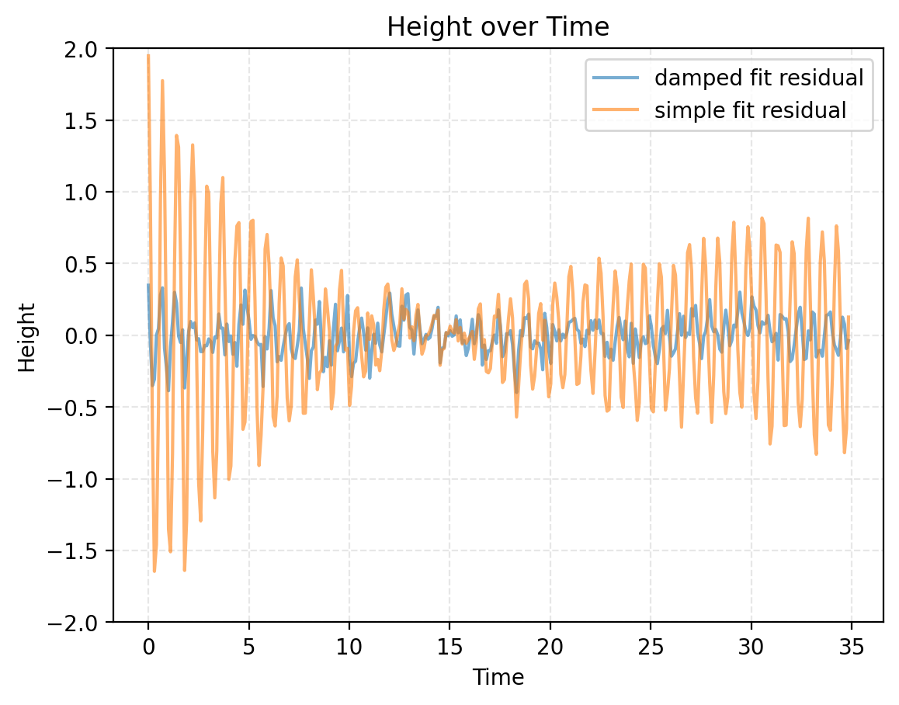

# Final Report

**Can AI Discover Physics from Observation?**
**Aum · HAL Sciences Research Internship · 2026**

> Guidance is in italics. Delete each note as you fill that section in. Write the
> abstract last. Five or six figures, each one referenced in the text.

## Abstract
**Gap** Most of this would probably need to be written from scratch
_The question, what you measured, what you found about the motion, what the models
did with your data, and how confident you are. Three to five sentences._

## 1. The question
**Gap:** need to from scratch why it matters
_~~State the question~~ and why it matters. Reciting a known law is not the same as
inferring one from evidence._
Can an AI actually reason the laws of nature with enough data, or is it simply using what it already knows?

## 2. Experiment
**Gap**: more explanation for masses, marker, camera, paddles, the conditions, and how I used the ruler to scale. 

_The apparatus: ~~spring~~, masses, marker, ruler, camera, foam paddles. How you
weighed the masses and how the ruler was used to set the length scale. The
conditions you ran, mass against paddle size, ~~the number of runs~~, and how they were
labeled. Enough detail to repeat it._

I tried a few springs before settling on the final ones, each which had their own problem. The first few springs were problematic because they were super small and super powerful. I could immediately tell they wouldn't work because I could barely stretch them, and even the heaviest of the weights we had wouldn't do enough. Then, we found weaker springs. The problem with some of them was that they couldn't handle the near 300g weight of some of the builds, meaning they would be broken by the time all the trials were done. The spring I settled on was the best of the weaker springs, allowing me to easily stretch it, record it, and not worry about it breaking from all the weight.
Since I used a yardstick, my data was all collected in inches.
I pulled the masses down 4 inches before releasing them. I recorded the 15 runs, restarting any that had too much of a side to side angle initially.

## 3. From video to data
**GAP** (I explained some of this in the notebook, but most of the process got reworked over time due to a variety of problems)
_Tracking, export, sampling rate, and the length of each run. How you cleaned the
data and where the tracking was unreliable._

## 4. The motion
**Gap:** Which model the residuals rule out and the figures. Most of the figures explanation portion of the notebook is written as if you already know everything there is to know, so ideally I would rewrite that here
_~~Fit the simple harmonic model, then the damped model. Show the residuals for both~~
and explain which model the residuals rule out._

_~~Report omega and gamma across the runs. How omega varies with mass, how gamma
varies with paddle size~~, and what happens to that relationship once the mass is
accounted for. ~~State your uncertainty in gamma~~ and where it comes from._

Table: fitted parameters, all runs 
| run | A | gamma | omega | phi | C | mass_grams | paddle_inches |
|---|---|---|---|---|---|---|---|
| run01 | 3.864506528425202 | 0.007638259995106397 | 8.868637988112674 | -0.040566865183067964 | -2.8799534080200275 | 178 | 0 |
| run02 | 4.3135050971649855 | 0.011985206227147261 | 8.844187572012746 | -2.8917571916275335 | -2.876449327973952 | 178 | 2 |
| run03 | 4.309071464070233 | 0.026396105559290648 | 8.735829909103119 | -1.3715739015891453 | -3.088496214830344 | 178 | 4 | 
| run04 | 2.972216399916491 | 0.05275184537335603 | 8.523898348608327 | 0.024327719412119326 | -3.368507585441482 | 178 | 6 |
| run05 | -3.613344716495994 | 0.006035424994761652 | 8.928362354143568 | -0.48125502781603197 | -2.9209323968807204 | 178 | 0 |
| run06 | -3.1079796667475574 | 0.004521683481783615 | 7.91007801145876 | -0.14536198270682324 | -4.235215801837623 | 230 | 0 |
| run07 | 3.320131130661165 | 0.006854484909060425 | 7.881842905724974 | 0.6289036290720371 | -4.396110771136967 | 230 | 2 |
| run08 | -3.2080864577003765 | 0.018280881392979148 | 7.772209077801825 | 1.1213293741742014 | -4.6055526196107675 | 230 | 4 |
| run09 | 3.2655212835976437 | 0.042287079566147724 | 7.608505061000907 | 1.0639809563930964 | -4.938896071638403 | 230 | 6 |
| run10 | -3.394304162670504 | 0.006255411409348167 | 7.873600951034485 | 0.9198028837294387 | -4.387837555759952 | 230 | 2 |
| run11 | -3.5634161567027274 | 0.003423121470489022 | 7.316541582446483 | 1.4100710582224019 | -21.838790676552424 | 272 | 0 |
| run12 | 3.185774300822344 | 0.0055575684164098395 | 7.293801253311689 | 2.4294495286360944 | -5.448331703445565 | 272 | 2 |
| run13 | 3.6370070716041507 | 0.015825717322693156 | 7.193147689610562 | 2.7330276888804144 | -5.690938606304936 | 272 | 4 |
| run14 | -3.9199897144691227 | 0.04044584514582836 | 7.060703330816897 | -0.16509905693293989 | -5.9656049355062875 | 272 | 6 |
| run15 | -3.6172024754870673 | 0.03543324322949454 | 7.039249623365725 | 0.25721132593381474 | -22.081895568139267 | 272 | 6 |

Figure 1 depicts the graph of the data for run04. That data was fed to the models for 4 of the 8 prompts, and importantly displays the effects of the 6 inch x 6 inch paddle. Figure 2 depicts the graph of the data for run11, which was also fed to the models, for the other 4 prompts. It shows why the models often didnt depict damping, as the high mass and lack of paddle has visibly less damping than other runs. Figure 3 depicts run15. This figure shows a run that had the same paddle size as run04, and roughly the same mass as run11. There is a clear difference in damping both caused by mass and paddle size when comparing these figures, as the paddle sizes depicted with figures 1 and 3 are the same, yet the damping is lessened in figure 3. In figure 2 and figure 3, the masses are nearly identical, yet there is visibly more damping in figure 3. Figure 3 also shows the effect of errors in tracking, making some numbers appear odd. Figure 4 depicts how mass influences omega, which follows the period equation ($T = 2\pi\sqrt{\frac{m}{k}}$). Figure 5 is further proof that paddles seriously effect damping, as gamma scales with paddle sizes quadratically. Figure 6 is there to show why there is a damping factor at all. It depicts the residuals when using a simple fit versus the more complicated fit for damped harmonic motion.
When I plotted the graph of the simple model's residual, the residuals appeared to follow asymptotes similar to hyperbolas, slightly rotated. There is a moment in the middle where the swap between the predictions having a magnitude too low and too high is visible. I plotted the residual for the damped model and it looked like basically random noise that's only pattern was having highs and lows on somewhat regular intervals, though with almost random (small) magnitudes. The residuals look completely different because the simple model's residuals were just way larger.
Omega decreased as masses increased, matching my earlier predictions. Omega decreasing, means a longer period (I misstyped this yesterday). This follows the period equation (which predicts that mass increases period). The omega values varied a decent bit in each mass group, but there is still a very clear trend line showing omega decreasing with mass. In the gamma verse paddle_size plot, it appears gamma increases with paddle sizes. It too varies a lot in each paddle group, with the sort of following a power curve, but it is unclear due to the fact there are only 4 sizes. Sizes 0 and 2 are pretty similar to each other, but by paddle size of 6, it becomes significantly clearer that paddles have a huge impact on gamma, meaning they increase decay rate as predicted.
There is some uncertainty in the gamma and omega values. The gamma values in run 1 vs run 5 are 0.0014 away, and omega values are 0.06 away. These aren't the largest differences, but they are relatively big still. This is the uncertainty in gamma and how I got to it.

## 5. Testing the models
**Gap** Actual explanation of the prompts, the actual runs chosen, and the specific model of each model
_~~The four rungs~~. For each, what was given and what was withheld, and how the answer
was kept out of the prompt. The two runs, and why the same prompt on two different
runs is a controlled comparison. The two models tested._

_Then the results. ~~The reasoned, recognized and failed classification across both
models.~~ The claimed values against your fitted values, including the unit
conversions needed before they could be compared. Whether the models distinguished
the two runs, and whether they said so or only behaved differently. What they
claimed about their own confidence, against what their answers showed._

Reasoned, recognized, failed, both models, all eight answers

| rung | run | gpt | claude |
|---|---|---|---|
| rung1 | run04 | recognized | recognized |
| rung2 | run04 | recognized | recognized |
| rung3 | run04 | reasoned | reasoned |
| rung4 | run04 | recognized | reasoned |
| rung1 | run11 | recognized | recognized |
| rung2 | run11 | reasoned | reasoned |
| rung3 | run11 | failed | failed |
| rung4 | run11 | reasoned | reasoned |

Claimed omega and gamma against fitted values

| model | rung | run | claimed omega | claimed gamma | percent off omega | percent off gamma |
|---|---|---|---|---|---|---|
| gpt | rung1 | run04 | 8.5 | 0.05 | -0.280368765920688 | -5.216585986479825 |
| gpt | rung2 | run04 | 8.5 | 0.05 | -0.280368765920688 | -5.216585986479825 |
| gpt | rung3 | run04 | 8.53 | 0.08 | 0.0715828737289962 | 51.65346242163228 |
| gpt | rung4 | run04 | 8.1 | 0.06 | -4.973057294583248 | 13.7400968162242 |
| gpt | rung1 | run11 | 7.3 | 0.003 | -0.22608471858027845 | -12.360691086681076 |
| gpt | rung2 | run11 | 7.2975439107776845 | none | -0.25965371008588084 | N/A |
| gpt | rung3 | run11 | 7.306029426953008 | none | -0.1436765632371389 | N/A |
| gpt | rung4 | run11 | 6.973568598423514 | none | -4.687638007085407 | N/A |
| claude | rung1 | run04 | 8.5 | 0.05263157894736842 | -0.280368765920688 | -0.22798524892614233 |
| claude | rung2 | run04 | 8.53 | 0.05 | 0.0715828737289962 | -5.216585986479825 |
| claude | rung3 | run04 | 8.49 | 0.05 | -0.39768597913724935 | -5.216585986479825 |
| claude | rung4 | run04 | 8.51999927653552 | 0.05 | -0.04574282697122404 | -5.216585986479825 |
| claude | rung1 | run11 | 7.317 | 0.0025 | 0.006265495088785938 | -26.96724257223423 |
| claude | rung2 | run11 | 7.315 | none | -0.021069824166394538 | N/A |
| claude | rung3 | run11 | 7.317 | none | 0.006265495088785938 | N/A |
| claude | rung4 | run11 | 7.307344512249859 | none | -0.12570242501852466 | N/A |

Here were the prompts used: 
I did an experiment where I pulled down and released a mass hanging from a spring with a paddle adding air resistance. The first column is time in seconds, and the second is vertical displacement. What equation describes this motion and what does each part of it mean?

I did an experiment, and here is the data that came from it. The first column is time in seconds, and the second is a measurement. What processes could produce this data and what equations would fit it?

I have this data with 2 columns, column 1 and column 2. Find some equation that can relate the data in these columns and explain how you got to it.

I did an experiment, and here is the data that came from it. The first column is time in seconds, and the second is a measurement. What processes could produce this data and what equations would fit it? How confident are you in your answer and what in the data supports it?

ChatGPT and Claude are two of the most advanced AIs there are. They could look at a bunch of data without even knowing what the numbers mean, and come up with an equation to fit the data. Both AIs acted very similar throughout the ladder, following the patterns when they were told more, sometimes reasoning when they were told less, and sometimes failing to reach the proper solution entirely. 
On the first prompt, when they were told basically everything, both times the AIs successfully pattern matched with what they had seen before, knowing that the mass-spring system is oscillations. They used this information, along with the information about the paddles, to successfully come to the correct general equation. Interestingly,  not giving this information while giving the same data sometimes altered the equation. When only told the time, in rung 2, they again seemed to pattern match with the damped data. They didn't seem to provide any reasoning, but rather recognized the oscillations and came to the equation. What is interesting is when given the data with less damping, they actually seemed to reason the equation. One possible reason this seemed to happen is that they decided to justify why there was no damping factor in their equation, though that a damping factor could be possible. Rung 3, with the information that the first column is time hidden, seemed to challenge the AIs more. They paid more attention to the data, and managed to reason their way to the equations. They reasoned why there should be a damping factor in the more damped run, but left the factor out in the less damped run. They seemed to both not even acknowledge damping this time, but also did not even acknowledge the physical processes that could have been involved (or in the case of Claude, hyper focused on unecessary specifics). Finally, on the last rung, there was a difference between the models. In the run that was less damped, both successfully reasoned through their equations. What is interesting is that when there was more damping, GPT seemed to have pattern matched whereas Claude actually explained its answer. This was an interesting difference, but it is one of many.
This agreement seems to show some small differences in the way the models behave, but the difference only occured once. Additionally, while the models acted as though they reasoned some of the time, they also showed signs of patttern matching. In one case, Claude even said that the data had oscillations the "signature" of the governing equation. The slight difference between the models, and the fact they chose a different equation with different prompts, is also something that would be present in humans. These similarities and oddities in their reasoning could be caused by anything from similar training data to the fact they are trained to be somewhat similar to humans. The data can support such conclusions, but at the same time also supports that the AIs are just really good pattern matchers and isn't completely proof they can reason. Additionally, the AIs are extremely confident, but that confidence doesn't seem to hold up. First, it is important to distinguish the confidence they claimed and the confidence they showed. Both models claimed to be very confident with their numbers when asked, but also give a ton of other explanations and equations to everything they said, suggesting that they not have been as confident as they claimed. They were correct to not be completely confident on the physical processes as they gave many example, not all of which were mass-spring systems, but the numbers are another story. The percent error on rung 4 for both runs is some of the highest error for both AIs, yet they also both claimed "high confidence" in their numbers. Their numbers were indeed quite close to the actual numbers, but that "high confidence" claim doesn't really hold up well; Claude even mentioned that it didn't know if its numbers were actually correct despite claiming to be confident on its numbers at one point. Rung 1 was a great run to act as basically a control run, testing if the models can get to the answer at all when everything is handed to them. Rung 2 is a good run for seeing if removing just a few pieces of information drastically changes the answer, and it also supports rung 4. Rung 3 was an interesting rung since it doesn't really ask for a process (hence why the AIs didnt provide one), but it still does somewhat test reasoning while not even asking for it. Ultimately, rung 4 was the best test instrument because it confronted the AIs directly asking for their confidence, while also hinting that reasoning was wanted (without explicitely asking for it). 

## 6. Discussion and limitations
**GAP** Would need to be written from scratch
_What the results mean, and what they do not establish. Sources of error:
calibration, tracking noise, the fit window, the number of runs and models, prompt
design, and the variability of model output on identical input._

## 7. Reflection

What surprised me the most across this experiment was the actual damping itself, which eventually determined the runs that we would use. I did originally predict that the runs with larger masses and smallest paddles would damp the least (that run was run 11, which matches up), but it still felt counter intuitive. This only made sense to me because of the physics equations, but it sounds insane to say. The sliding (not air) friction force, for example, increases with mass (mu\*mg*costheta,most of the time.) 
Designing the questions was an interesting challenge because it required carefully saying enough to get the AIs to discuss what I wanted them to without even hinting as to what I was doing. I couldn't even really say "experiment" as that could suggest what I did was measure controlled variables and almost completely eliminates possibilities like measuring the distribution of random numbers. Physics is concrete, writing is not.
I don't think I would change how I use AIs in schoolwork. I have always tried to give them as much context as possible, and I have generally been good at catching their errors (which I have seen them make a few times). It seems newer models are better at doing this work, which makes them even better at what I use AIs for -- checking and understanding the process to get to my answers.
If I had another week to test these models, I think I would change the units, and maybe even organizing by height rather than time. The idea of changing units feels like it would be the best test because there is a low chance the AIs are trained on any data with odd units for something like harmonic motion. This test way line up with real life because right now it may seem crazy to do an experiment and organize by something as crazy as arctan(time), but perhaps that will reveal a secret we need to discover more. AIs would have to be able to reason even with oddities like that in play if they are to truly assist us in the future. I think if this were to be tested, they would fail if the units are obscure enough, but could maybe survive a rung or 2 with a simple change like time in seconds squared. Shuffling the data to organize by something else might be a helpful tool as it would also show up in real physics, but I imagine the AIs would just change it to be by time before doing any calculations.

## 8. Conclusion

**GAP** mostly from scratch
_The answer, or the honest non-answer, to the question in section 1._

## Data and code
**GAP**
_Where the dataset and the analysis code can be found._

---

### Before you call it done
- [ ] Every figure is labeled and referenced in the text.
- [ ] Every claim is supported by your data.
- [ ] Limitations stated, including the ones that weaken your result.
- [ ] You can explain every sentence and every line of code.
- [ ] Abstract written last, and consistent with the report.
