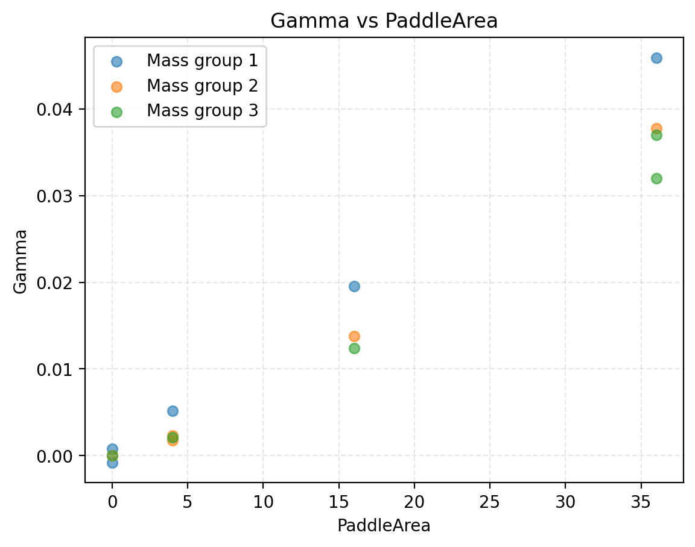

# Final Report

**Can AI Discover Physics from Observation?**
**Aum · HAL Sciences Research Internship · 2026**

## Abstract

The question is "Can an AI actually reason the laws of nature with enough data, or is it simply using what it already knows?" I did an experiment where I measured the vertical displacement over time of a mass-spring system when pulled a consistant amount with varying masses and paddle sizes. The motion appeared to dampen following the equation for a damped harmonic oscillator: $y(t) = A e^{-\gamma t}\cos(\omega t + \phi) + C$. I had 2 AIs process the data for 2 of my runs and figure out the equations that fit the data to see if they can reason, which they did somewhat like humans. Ultimately, I found the results to be inconclusive as there were was limited data, errors, and other factors that made it harder to determine to what extent the models were reasoning.

## 1. The question

Can an AI actually reason the laws of nature with enough data, or is it simply using what it already knows?
It is important to know the difference between when an AI is just reciting a law compared to when it is genuinely figuring a law out. If AI is to help humanity in the future, it cannot just rediscover already known physics, it has to work with the data to come up with something new. This experiment was designed to see if AIs are capable of figuring out something new from data.

## 2. Experiment

I tried a few springs before settling on the final ones, each which had their own problem. The first few springs were problematic because they were super small and super powerful. I could immediately tell they wouldn't work because I could barely stretch them, and even the heaviest of the weights we had wouldn't do enough. Then, we found weaker springs. The problem with some of them was that they couldn't handle the near 300g weight of some of the builds, meaning they would be broken by the time all the trials were done. The spring I settled on was the best of the weaker springs, allowing me to easily stretch it, record it, and not worry about it breaking from all the weight. The smallest mass I used was 178 grams, the middle mass was 230 grams, and the largest mass was 272 grams. These massses were built from nuts and washers on an eyebolt. I weighed each mass using a kitchen scale multiple times, and took the most common result. The smallest paddle added 1 gram of weight, the medium sized paddle added 7 grams, and the largest paddle added 15 grams of weight. The hook that connected my spring to the maasses had a little red marker on it that I was able to use as a reference point during tracking. My camera was set up level, a decent distance away, alowing me to capture the full vertical and horizontal swing. Each paddle was made of foam cut from the same board, and had dimensions of 2x2, 4x4, and 6x6. They were mounted directly onto the middle of the eyebolt. I set up a ruler next to the hanging mass, just far enough away that it wouldn't interfere with the motion. Since I used a yardstick, my data was all collected in inches. I pulled the masses down 4 inches before releasing them. I recorded the 15 runs, restarting any that had too much of a side to side swing initially. There were 5 runs per mass: 1 for each paddle size (including no paddle), and a repeat for the 5th run of each group. Run05 was no paddle, run10 was a 2x2 paddle, and run15 was a 6x6 paddle. Each run was labeled with a mass and paddle key. M1, M2, or M3, and P0, P2, P4, or P6.

## 3. From video to data

I used the Tracker video analysis tool to track the videos. I put them into tracker, and marked a consistent point in my set up every three frames to track the oscillations. I had a red marker on my physical set up that I could follow in tracking. The length of each run was 35 seconds, 30 fps. I exported the data to a csv file using a comma as the delimeter, and then used a python script with pandas to remove lines that had any missing values (which were the lines that had the untracted frames.) The way I calibrated the tracking was scaling with the ruler.  The tracking only really appeared unreliable for run 15, where there were seemingly random peaks every 3 or so oscillations.

## 4. The motion

Table: fitted parameters, all runs 
| run | A | gamma | omega | phi | C | mass_grams | paddle_inches |
|---|---|---|---|---|---|---|---|
| run01 | 3.8645 | 0.0076 | 8.8686 | -0.0406 | -2.8800 | 178 | 0 |
| run02 | 4.3135 | 0.0120 | 8.8442 | -2.8918 | -2.8764 | 178 | 2 |
| run03 | 4.3091 | 0.0264 | 8.7358 | -1.3716 | -3.0885 | 178 | 4 | 
| run04 | 2.9722 | 0.0528 | 8.5239 | 0.0243 | -3.3685 | 178 | 6 |
| run05 | -3.6133 | 0.0060 | 8.9283 | -0.4813 | -2.9209 | 178 | 0 |
| run06 | -3.1080 | 0.0045 | 7.9100 | -0.1454 | -4.2352 | 230 | 0 |
| run07 | 3.3201 | 0.0069 | 7.8818 | 0.6289 | -4.3961 | 230 | 2 |
| run08 | -3.2081 | 0.0183 | 7.7722 | 1.1213 | -4.6056 | 230 | 4 |
| run09 | 3.2655 | 0.0423 | 7.6085 | 1.0640 | -4.9389 | 230 | 6 |
| run10 | -3.3943 | 0.0063 | 7.8736 | 0.9198 | -4.3878 | 230 | 2 | 
| run11 | -3.5634 | 0.0034 | 7.3165 | 1.4101 | -21.8388 | 272 | 0 | 
| run12 | 3.1858 | 0.0056 | 7.2938 | 2.4294 | -5.4483 | 272 | 2 | 
| run13 | 3.637 | 0.0158 | 7.1931 | 2.733 | -5.6909 | 272 | 4 | 
| run14 | -3.92 | 0.0404 | 7.0607 | -0.1651 | -5.9656 | 272 | 6 |
| run15 | -3.6172 | 0.0354 | 7.0392 | 0.2572 | -22.0819 | 272 | 6 | 

Figure 1 depicts the graph of the data for run04. That data was fed to the models for 4 of the 8 prompts, and clearly displays the effects of the 6 in x 6 in paddle. Figure 2 depicts the graph of the data for run11, which was also fed to the models, in the other 4 prompts. This run had a high mass and no paddle, resulting in much less visible damping. This figures makes it clearer why the models didn't often include damping in their analysis of this run.
Figure 3 depicts run15. This figure provides great comparisons between masses and paddles. The run that had the same paddle size as run04, and roughly the same mass as run11. There is a clear difference in damping caused by mass as the paddle sizes depicted with figures 1 and 3 are the same, yet the damping is lessened in figure 3. Similarly, in figure 2 and figure 3, the masses are nearly identical, yet there is visibly more damping in figure 3 suggesting that paddles matter. Figure 3 also shows the effect of errors in tracking, making some numbers appear odd.
Figure 4 depicts how mass influences $\omega$ (omega), which follows the period equation ($T = 2\pi\sqrt{\frac{m}{k}}$). Period increases with mass, causing omega to decrease (as it is inversly proptional to period). Figure 5 is further proof that paddles seriously effect damping, as $\gamma$ (gamma) scales with paddle sizes quadratically. This is due to air resistance, with the effect of paddle dimensions being squared due to the fact that surface area matters, not side length.
Figure 6 is there to show why there is a damping factor at all. It depicts the residuals when using a simple fit versus the more complicated fit for damped harmonic motion. When I plotted the graph of the simple model's residual, the residuals appeared to follow asymptotes similar to hyperbolas, slightly rotated. There is a moment in the middle where the swap between the predictions having a magnitude too low and too high is visible. I plotted the residual for the damped model and it looked like basically random noise that's only pattern was having highs and lows on somewhat regular intervals, though with almost random (small) magnitudes. The residuals look completely different because the simple model's residuals were just way larger.
Omega decreased as masses increased, matching my earlier predictions. Omega decreasing means a longer period. This follows the period equation (which predicts that mass increases period). The omega values varied a decent bit in each mass group, but there is still a very clear trend line showing omega decreasing with mass. In the gamma verse paddle_size plot, it appears gamma increases with paddle sizes. It too varies a lot in each paddle group, with the sort of following a power curve, but it is unclear due to the fact there are only 4 sizes. Sizes 0 and 2 are pretty similar to each other, but by paddle size of 6, it becomes significantly clearer that paddles have a huge impact on gamma, meaning they increase decay rate as predicted.
There is some uncertainty in the gamma and omega values. The gamma values in run 1 vs run 5 are 0.0014 away, and omega values are 0.06 away. These aren't the largest differences, but they are relatively big still. The uncertainty in gamma is close to roughly 0.005 overall, as that is the gap in the gammas between runs 14 and 15.
When comparing gamma to paddle size squared, instead the effect of paddle surface area can be seen. After adjusting the gamma values to remove the baseline gamma from the spring and masses, the gamma vs paddle size squared ratio appears to be quite linear. This is what appears in figure 7, with each mass group getting a different color. When accounting for mass, the relationship should have been $p_c = \tfrac{2*m*\gamma}{size^2}$ where $p_c$ is paddle constant, $m$ is mass, $\gamma$ is gamma adjusted, and $size^2$ is paddle area. After following this equation, each paddle size should have a roughly equal constant, but instead I found that they only held for the smallest masses I tested. When working with bigger masses, each paddle seemed to have a random constant that didn't even hold between seemingly identical runs (like runs 7 and 10 having constants that were different by about 0.07 despite having the same mass and paddle size). It can't be known from just this data alone, but it is likelier that the paddle constants are similar and do follow that equation because they held for the only mass group where the baseline damping that I subtracted was an average of 2 numbers, meaning more precision. Another potential reason these numbers were off is because of the actual way air resistance works. Air resistance on a flat paddle is closer to being proportional to speed squared, but my assumptions are off the idea that air resistance is proportional to speed. These are good effective numbers, but not really exact physical constants. Noticably in the data, every run with a 6 inch paddle had a roughly equal guess for the constant. This guess also matches with the guess that can be made from the first mass group: 0.45. Perhaps the issue that caused the constants to be so random was that the paddle sizes were so small the effects were negligible, which would also explain why the gaps for the 2x2 in paddle were so large.

## 5. Testing the models

Reasoned, recognized, failed, both models, all eight answers

| rung | run | gpt | claude |
|---|---|---|---|
| rung1 | run04 | recognized | recognized |
| rung2 | run04 | recognized | recognized |
| rung3 | run04 | reasoned | reasoned |
| rung4 | run04 | recognized | reasoned |
| rung1 | run11 | recognized | recognized |
| rung2 | run11 | reasoned | reasoned |
| rung3 | run11 | failed | failed |
| rung4 | run11 | reasoned | reasoned |

Claimed omega and gamma against fitted values

| model | rung | run | claimed omega | claimed gamma | percent off omega | percent off gamma |
|---|---|---|---|---|---|---|
| gpt | rung1 | run04 | 8.5 | 0.05 | -0.280368765920688 | -5.216585986479825 |
| gpt | rung2 | run04 | 8.5 | 0.05 | -0.280368765920688 | -5.216585986479825 |
| gpt | rung3 | run04 | 8.53 | 0.08 | 0.0715828737289962 | 51.65346242163228 |
| gpt | rung4 | run04 | 8.1 | 0.06 | -4.973057294583248 | 13.7400968162242 |
| gpt | rung1 | run11 | 7.3 | 0.003 | -0.22608471858027845 | -12.360691086681076 |
| gpt | rung2 | run11 | 7.2975439107776845 | none | -0.25965371008588084 | N/A |
| gpt | rung3 | run11 | 7.306029426953008 | none | -0.1436765632371389 | N/A |
| gpt | rung4 | run11 | 6.973568598423514 | none | -4.687638007085407 | N/A |
| claude | rung1 | run04 | 8.5 | 0.05263157894736842 | -0.280368765920688 | -0.22798524892614233 |
| claude | rung2 | run04 | 8.53 | 0.05 | 0.0715828737289962 | -5.216585986479825 |
| claude | rung3 | run04 | 8.49 | 0.05 | -0.39768597913724935 | -5.216585986479825 |
| claude | rung4 | run04 | 8.51999927653552 | 0.05 | -0.04574282697122404 | -5.216585986479825 |
| claude | rung1 | run11 | 7.317 | 0.0025 | 0.006265495088785938 | -26.96724257223423 |
| claude | rung2 | run11 | 7.315 | none | -0.021069824166394538 | N/A |
| claude | rung3 | run11 | 7.317 | none | 0.006265495088785938 | N/A |
| claude | rung4 | run11 | 7.307344512249859 | none | -0.12570242501852466 | N/A |

Here were the prompts used: 
I did an experiment where I pulled down and released a mass hanging from a spring with a paddle adding air resistance. The first column is time in seconds, and the second is vertical displacement. What equation describes this motion and what does each part of it mean?

I did an experiment, and here is the data that came from it. The first column is time in seconds, and the second is a measurement. What processes could produce this data and what equations would fit it?

I have this data with 2 columns, column 1 and column 2. Find some equation that can relate the data in these columns and explain how you got to it.

I did an experiment, and here is the data that came from it. The first column is time in seconds, and the second is a measurement. What processes could produce this data and what equations would fit it? How confident are you in your answer and what in the data supports it?

The AIs responded very differently betweens the runs is because of the runs chosen. The first 4 prompts used the data from run04, which was the run that had the most damping across all 15 of my runs. This meant the AIs were significantly more likely to add a damping factor to their equations. On the other hand, they had to work with the data from run11 for the other 4 prompts. That data barely had an damping at all, so the AIs often omitted the damping factor from their equations. They only put it into rung 1 because it was an explanation of the experiment, and the little bit about the paddles probably subtly hinted to them that damping matters. Rung 2's prompt, on the other hand, only tells them that there was an experiment involving time, not what the experiment actually was. This meant they couuld guess that it was some physical process that involved oscillations, but they couldn't guess what. Rung 4 was similar to rung 2, except the AIs had to work with rounded data. The major difference in the data also meant that rung 4 was perfect to check for the AI's confidence in their answers, as they had much less to work with. Rung 3 doesn't use rounded data, but uses a more obscure prompt. Instead of knowing I did an experiment involving time, all the AIs knew is that I had some data. They were asked to relate the data and explain why they related the data the way they did, but not what could produce it. Also, the AIs gave the numbers in a variety of different ways. ChatGPT gave omega using period in rungs2-4 for run11, so I converted it back into omega using $\omega = \tfrac{2\pi}{T}$. Similarly, on rung 4 for both runs, Claude gave omega in frequency, so I had to convert it back into omega using $\omega = 2\pi f$. Claude also gave gamma in $\tau$ (tau) the majority of the time, which I converted using $\gamma = \tfrac{1}{\tau}$
ChatGPT 5.5 and Claude Opus 5 are two of the most advanced AIs there are. They could look at a bunch of data without even knowing what the numbers mean, and come up with an equation to fit the data. Both AIs acted very similar throughout the ladder, following the patterns when they were told more, sometimes reasoning when they were told less, and sometimes failing to reach the proper solution entirely. 
On the first prompt, when they were told basically everything, both times the AIs successfully pattern matched with what they had seen before, knowing that the mass-spring system is oscillations. They used this information, along with the information about the paddles, to successfully come to the correct general equation. Interestingly,  not giving this information while giving the same data sometimes altered the equation. When only told the time, in rung 2, they again seemed to pattern match with the damped data. They didn't seem to provide any reasoning, but rather recognized the oscillations and came to the equation. What is interesting is when given the data with less damping, they actually seemed to reason the equation. One possible reason this seemed to happen is that they decided to justify why there was no damping factor in their equation, though that a damping factor could be possible. Rung 3, with the information that the first column is time hidden, seemed to challenge the AIs more. They paid more attention to the data, and managed to reason their way to the equations. They reasoned why there should be a damping factor in the more damped run, but left the factor out in the less damped run. They seemed to both not even acknowledge damping this time, but also did not even acknowledge the physical processes that could have been involved (or in the case of Claude, hyper focused on unecessary specifics). Finally, on the last rung, there was a difference between the models. In the run that was less damped, both successfully reasoned through their equations. What is interesting is that when there was more damping, GPT seemed to have pattern matched whereas Claude actually explained its answer. This was an interesting difference, but it is one of many.
This agreement seems to show some small differences in the way the models behave, but the difference only occured once. Additionally, while the models acted as though they reasoned some of the time, they also showed signs of patttern matching. In one case, Claude even said that the data had oscillations the "signature" of the governing equation. The slight difference between the models, and the fact they chose a different equation with different prompts, is also something that would be present in humans. These similarities and oddities in their reasoning could be caused by anything from similar training data to the fact they are trained to be somewhat similar to humans. The data can support such conclusions, but at the same time also supports that the AIs are just really good pattern matchers and isn't completely proof they can reason. Additionally, the AIs are extremely confident, but that confidence doesn't seem to hold up. First, it is important to distinguish the confidence they claimed and the confidence they showed. Both models claimed to be very confident with their numbers when asked, but also give a ton of other explanations and equations to everything they said, suggesting that they not have been as confident as they claimed. They were correct to not be completely confident on the physical processes as they gave many example, not all of which were mass-spring systems, but the numbers are another story. The percent error on rung 4 for both runs is some of the highest error for both AIs, yet they also both claimed "high confidence" in their numbers. Their numbers were indeed quite close to the actual numbers, but that "high confidence" claim doesn't really hold up well; Claude even mentioned that it didn't know if its numbers were actually correct despite claiming to be confident on its numbers at one point. Rung 1 was a great run to act as basically a control run, testing if the models can get to the answer at all when everything is handed to them. Rung 2 is a good run for seeing if removing just a few pieces of information drastically changes the answer, and it also supports rung 4. Rung 3 was an interesting rung since it doesn't really ask for a process (hence why the AIs didnt provide one), but it still does somewhat test reasoning while not even asking for it. Ultimately, rung 4 was the best test instrument because it confronted the AIs directly asking for their confidence, while also hinting that reasoning was wanted (without explicitely asking for it). 

## 6. Discussion and limitations

These results imply that both of these AIs have some level of human-like reasoning, and clearly show that at the very least, they can recognize patterns in data. These results cannot concretely establish that the AIs are actually capable of reasoning, though. Both models answer to the best of their abilities based on the prompts they were given. These prompts also might've subtly influenced the models, making it harder to analyize their results. Since no prompts besides those in rung 4 ask for confidence, confidence was only implied in most runs. Additonally, rung 3 never asks for the physical process, so the models often didn't provide any for that rung. The reason the AI's reasoning seems human-like is because of these prompts, however. For run11, both models only put a damping factor in when paddles were mentioned but otherwise did not. Similarly, humans can often change their behaviors depending on context, so including the damping factor only when given this context is quite human-like. Despite this, the models still seem to prefer pattern matching over genuine reasoning. Both Claude and ChatGPT implied this occassionally by mentioning how the data looked sinusoidal, meaning it followed a certain already established equation. There were some other limitations as well. The fact there were only 2 models is another limitation to this experiment, as it means less information to work with. Also, models can vary their responses to identical prompts, and only one response for each prompt was even looked at. There are other sources of errors in this experiment too. There was clearly some noise in tracking, which is especially visible in run15. Additionally, any issues in the calibration could've influenced the data, and each of these errors would be magnified by the fact that there were only 15 runs to work with, of which only 2 were given to the models. There were also issues in the analysis of the physics itself. The fact only 1 run in each mass group (besides the first) had no paddle meant that the baseline being worked with was less accurate. This contributed to problems such as those with calculating the paddle constant, along with assuming things like air resistance being proportional to speed rather than speed squared.

## 7. Reflection

What surprised me the most across this experiment was the actual damping itself, which eventually determined the runs that we would use. I did originally predict that the runs with larger masses and smallest paddles would damp the least (that run was run 11, which matches up), but it still felt counter intuitive. This only made sense to me because of the physics equations, but it sounds insane to say. The sliding (not air) friction force, for example, increases with mass (mu\*mg*costheta,most of the time.) 
Designing the questions was an interesting challenge because it required carefully saying enough to get the AIs to discuss what I wanted them to without even hinting as to what I was doing. I couldn't even really say "experiment" as that could suggest what I did was measure controlled variables and almost completely eliminates possibilities like measuring the distribution of random numbers. Physics is concrete, writing is not.
I don't think I would change how I use AIs in schoolwork. I have always tried to give them as much context as possible, and I have generally been good at catching their errors (which I have seen them make a few times). It seems newer models are better at doing this work, which makes them even better at what I use AIs for -- checking and understanding the process to get to my answers.
If I had another week to test these models, I think I would change the units, and maybe even organizing by height rather than time. The idea of changing units feels like it would be the best test because there is a low chance the AIs are trained on any data with odd units for something like harmonic motion. This test way line up with real life because right now it may seem crazy to do an experiment and organize by something as crazy as arctan(time), but perhaps that will reveal a secret we need to discover more. AIs would have to be able to reason even with oddities like that in play if they are to truly assist us in the future. I think if this were to be tested, they would fail if the units are obscure enough, but could maybe survive a rung or 2 with a simple change like time in seconds squared. Shuffling the data to organize by something else might be a helpful tool as it would also show up in real physics, but I imagine the AIs would just change it to be by time before doing any calculations.

## 8. Conclusion

So can an AI actually reason the laws of nature with enough data, or is it simply using what it already knows? The honest answer that came out of this experiment is that it is still hard to say. There were only 2 runs, each of which got 4 prompts to test the 2 models. The AIs acted as though they reasoned when they weren't given enough info to instantly pattern match, yet still implied they did indeed pattern match by looking at oscillations and saying they must follow an already known equation. The models acted like humans in that they saw an already solved problem and recited the solution, but ultimately there was nothing new so it is hard to definitively say whether this was done by reasoning the law or recalling it.

## Data and code

The dataset and analysis code can be found at github.com/HAL-Sciences/aum-physics-internship. 
---

### Before you call it done
- [x] Every figure is labeled and referenced in the text.
- [x] Every claim is supported by your data.
- [x] Limitations stated, including the ones that weaken your result.
- [x] You can explain every sentence and every line of code.
- [x] Abstract written last, and consistent with the report.
